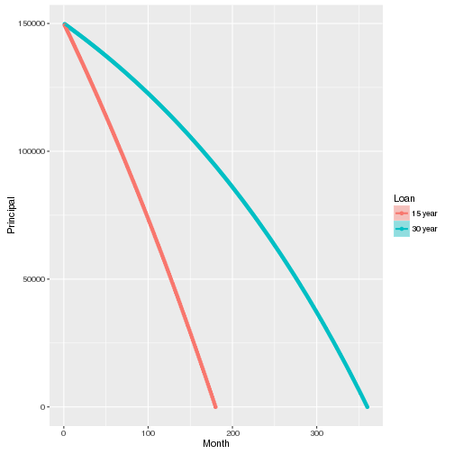

15 year vs. 30 year Mortgage
========================================================
author: Noah Hughes
date: 2/14/2016

A Choice
========================================================

When making a decision to refiance there is always the question of should I do a 15 year or 30 year mortgage

- What is the cost difference?
- What does paying it off early get me?
- Should you do it?

Slide With Code
========================================================


```r
library(ggplot2)
Amort <- function(principala,rate,numMonth,group){
  
  df <- data.frame(Month = integer(),
                   Principal=double(),
                   Payment = double(),
                   Interest = double(),
                   Loan = character(),
                   stringsAsFactors=FALSE
  )
  loopPrincipal <- principala
  monthcount = 0
  payment <- principala *((rate/12/100*(1+rate/12/100)^numMonth)/((1+rate/12/100)^numMonth - 1))
  payment <- round(payment, digits = 2)
  group <- as.character(group)
  
  for (i in 1:numMonth){
    monthcount <- monthcount +1
    interestpmt <- round(loopPrincipal * rate/12/100, digits = 2)
    loopPrincipal <- round(loopPrincipal - payment + interestpmt, digits = 2)
    
    df[nrow(df)+1,] <- c(monthcount,loopPrincipal,payment,interestpmt,group)
    
  }
  df <- transform(df, Month = as.numeric(Month), Principal = as.numeric(Principal))
  return(df)
}

combinedf <- function(df1,df2){
  
  df <- rbind(df1,df2)
  return(df)
}

graphstuff <- function(df){
  df22 <- data.frame(df)
  g <- ggplot(df22, aes(x=Month, y=Principal, group=Loan, col=Loan, fill=Loan)) +
    geom_point() +
    geom_smooth(size=1)
  
  return(g)
}
```

Slide To Call Functions
========================================================


```r
df1 <- Amort(150000,3.5,360,"30 year")
df2 <- Amort(150000,2.5,180,"15 year")

df <- combinedf(df1,df2)
```

Plotting the Payback Period for the Loan
========================================================


